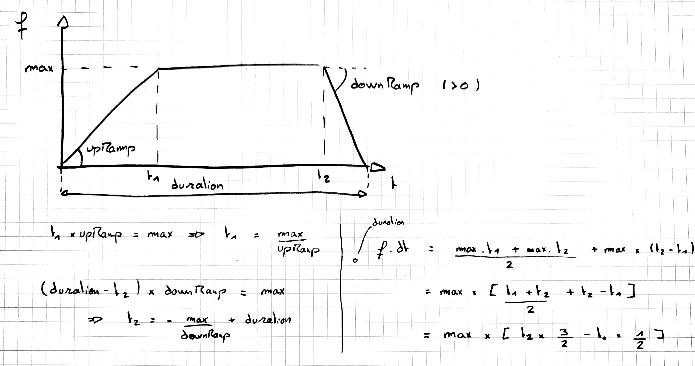
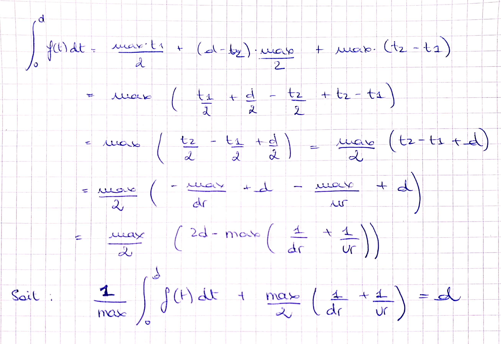

# Robot principal ENSMASTEEL

## Trajectoire

### Principe

Commençons par déterminer la trajectoire du robot lorsqu'il se déplace d'un point A à un point B. Pour se faire nous calculons deux polynômes définissant l'abscisse X et l'ordonnée Y en fonction d'une variable arbitraire notée t*. Ces fonctions sont des [courbes de Bézier d'ordre 3](https://www.desmos.com/calculator/cahqdxeshd "Bezier viewer"). On peut alors tracer la trajectoire en connaissant le point de départ __(X0,Y0)__, le point d'arrivé __(X3,Y3)__ et les points intermédiaires __(X1,Y1)__ et __(X2,Y2)__. Ces points intermédiraires sont déterminés pour obtenir la courbure et plus particulièrement, l'orientation initiale et finale du robot.
L'orientation du robot est essentielle pour effectuer les actions, nous devons donc pouvoir contrôler l'orientation d'arrivé en __(X3,Y3)__. On se contentera de partir dans le sens initial du robot en début de trajectoire, quitte à tourner avant.


Nous stockons toutes les informations relatives à la trajectoire dans un objet _Ghost_. Le robot physique se contentera de suivre cette trajectoire par un asservissement en position. Afin de permettre au robot de suivre la trajectoire, la position ne suffit pas, il faut aussi la vitesse de déplacement. La variable t* des courbes de Beziers n'a aucun sens temporellement. On souhaite imposer la vitesse progressivement. On définit alors une fonction _V(t)_ déterminant la vitesse d'avancer le long de l'abscisse curviligne décrivant la trajectoire. On a alors _dt*=(V(t)/V*(t*))x(dt)_ avec _dt_ le temps écoulé entre deux tour de boucle (de calcul), _V*(t*)_ la vitesse réelles _V*²(t*)=X’(t*)²+Y’(t*)²_ où _X_ et _Y_ sont les courbes de Beziers) et _dt*_ le pas d'incrémentation de _t*_ pour le calcul de la position suivante. _(cf Passation-CODE.docx pour plus de détails)_

### Calculs du profil de vitesse d'une trajectoire






### Utilisation de la classe __Ghost__

L'ensembles des positions sont stocker sous forme de _VectorE(x, y, theta)_ indiquant la position en coordonées x,y en mètres et l'orientation du robot en radiants _(note : theta est toujours compris dans [-PI; PI])_. Le type _Cinetique_ est attendu en entrée d'asservissement. Il contient la position et l'orientation du Ghost en temps réelle et sa vitesse linéaire et en rotation dans le futur d'un délai de _delayPosition_ en milli-secondes. Ce délai permet à l'asservissement de "prédire" les accélérations/décélérations afin d'etre plus fluide.

__Méthodes utiles :__

*   ```c++
    bool IsLocked();
    bool IsRotating();
    bool IsBackward();
    bool trajectoryIsFinished();
    ```

    Méthodes d'accées aux variables homonymes.

    _locked = true_ : le Ghost est bloqué en position, l'actualisation de la position est bloqué. Variable initialisé à True.

    _rotating = true_ : le Ghost effectue une simple rotation, seule l'orientation varie.

    _backward = true_ : le Ghost évolue en marche arrière.

    _trajectoryFinished = true_ : le Ghost est arrivé à la position souhaitée.

* ```c++
    void Lock(bool state);
    ```

    Permet de modifier l'état de _locked_

* ```c++
    int ActuatePosition(float dt);
    ```

    Met à jours la position (et orientation) du Ghost selon la trajectoire en mémoire. Le temps dt en seconde indique le temps écoulé depuis le dernier appel de la fonction afin de connaitre la distance à parcourir.

* ```c++
    int Compute_Trajectory(VectorE posFinal, float deltaCurve, 
                           float speedRamps, float cruisingSpeed, 
                           bool pureRotation = false, bool backward = false);
    ```

    Calcul et stocke la nouvelle trajectoire atteignat _posFinal_ avec un parametre de courbe _deltaCurve_. Le parametre _speedRamps_ en m/s indique l'accélération et la décélération. _cruisingSpeed_ est la vitesse de croisiere du Ghost. L'état de _pureRotation_ indique s'il est souhaité que le robot éxécute une simple rotation (x et y constants). L'état de _backward_ indique s'il est souhaité que le Ghost évolue en marche arriere.

* ```c++
    Cinetique Get_Controller_Cinetique();
    ```

    Renvoies la variable d'entrée de l'asservissement.

## Les séquences d'actions

...
