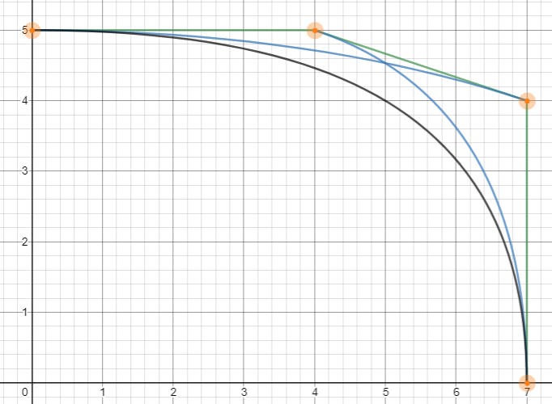
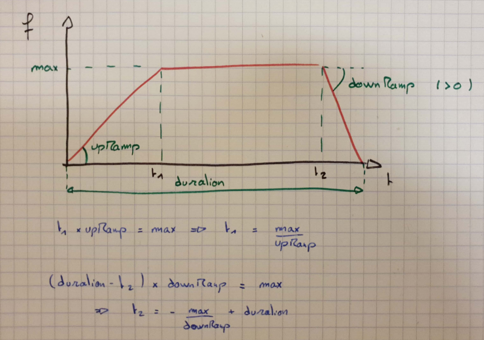

# Robot principal ENSMASTEEL

## Trajectoire

### Principe

Commençons par déterminer la trajectoire du robot lorsqu'il se déplace d'un point A à un point B. Pour se faire nous calculons deux polynômes définissant l'abscisse X et l'ordonnée Y en fonction d'une variable arbitraire notée t*. Ces fonctions sont des [courbes de Bézier d'ordre 3](https://www.desmos.com/calculator/cahqdxeshd "Bezier viewer"). On peut alors tracer la trajectoire en connaissant le point de départ __(X0,Y0)__, le point d'arrivé __(X3,Y3)__ et les points intermédiaires __(X1,Y1)__ et __(X2,Y2)__. Ces points intermédiraires sont déterminés pour obtenir la courbure et plus particulièrement, l'orientation initiale et finale du robot.
L'orientation du robot est essentielle pour effectuer les actions, nous devons donc pouvoir contrôler l'orientation d'arrivé en __(X3,Y3)__. On se contentera de partir dans le sens initial du robot en début de trajectoire, quitte à tourner avant.



Nous stockons toutes les informations relatives à la trajectoire dans un objet _Ghost_. Le robot physique se contentera de suivre cette trajectoire par un asservissement en position. Afin de permettre au robot de suivre la trajectoire, la position ne suffit pas, il faut aussi la vitesse de déplacement. La variable t* des courbes de Beziers n'a aucun sens temporellement. On souhaite imposer la vitesse progressivement. On définit alors une fonction _V(t)_ déterminant la vitesse d'avancer le long de l'abscisse curviligne décrivant la trajectoire. On a alors _dt*=(V(t)/V*(t*))x(dt)_ avec _dt_ le temps écoulé entre deux tour de boucle (de calcul), _V*(t*)_ la vitesse réelles _V*²(t*)=X’(t*)²+Y’(t*)²_ où _X_ et _Y_ sont les courbes de Beziers) et _dt*_ le pas d'incrémentation de _t*_ pour le calcul de la position suivante. _(cf Passation-CODE.docx pour plus de détails)_



### Specifications

```c++
class Ghost {
public:
    Ghost(VectorE posEini);

    // VARIABLES //

    VectorE posCurrent;  // VectorE : struct type containing X,Y,Orientation
    bool locked=true;    // locked=true => no movement allowed
    bool moving=false;   // moving=true => trajectory not ended
    Polynome trajectory_X, trajectory_Y, ; // Bezier curves, function of t*

    float t=0.0, t_e=0.0; // t : time since new trajectory setup ; 0<t_e<1 virtual time of Bezier curves

    // METHODES //

    int rotate(float theta); // Rotation of _theta_rad
    int actuate(float dt);   // Update position with trajectory
    void Set_Trajectory(Polynome newTrajectoryX, Polynome newTrajectoryY); // store new trajectories
    void Compute_Trajectory(VectorE posFinal, float deltaCurve);
    void lock();
};
```

```c++
class Polynome
{
public:
    float K[7];        //Les 10 coefficients du polynome, K[i] est le coefficient devant x^i
    float f(float x);  //value of the function in x
    float df(float x); //value of the derivative function in x
    float ddf(float x);
    void set(float a0, float a1, float a2, float a3, float a4, float a5, float a6);

    int DEGRE_MAX = 7;
};

Polynome init_polynome(float a0 = 0.0, float a1 = 0.0, float a2 = 0.0, float a3 = 0.0, float a4 = 0.0, float a5 = 0.0, float a6 = 0.0);
Polynome Derivative_ptr(Polynome* P);
Polynome multiplication_ptr(Polynome* P1,Polynome* P2);
Polynome Square_ptr(Polynome* P);
Polynome Sum_ptr(Polynome* P1,Polynome* P2);

class Trapezoidal_Function
{
public:
    Trapezoidal_Function();
    Trapezoidal_Function(float upRamp, float downRamp, float max, float duration);

    void set(float upRamp, float downRamp, float max, float duration);
    float _upRamp, _downRamp, _max, _duration; //upRamp : acceleration ; max : maximum value ; downRamp : deceleration ; duration : totale duration of the function (f(x)!=0 <=> 0<x<duration)
    float f(float x);                          //value of the function in x
    float df(float x);                         //value of the derivative function in x
    //float ddf(float x);
};
```
